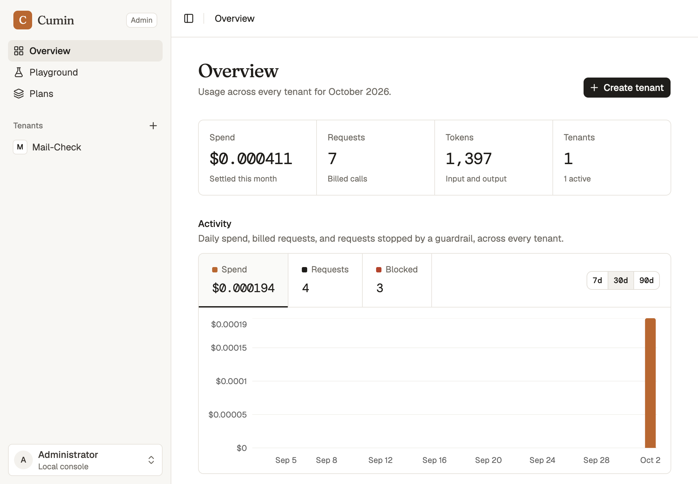
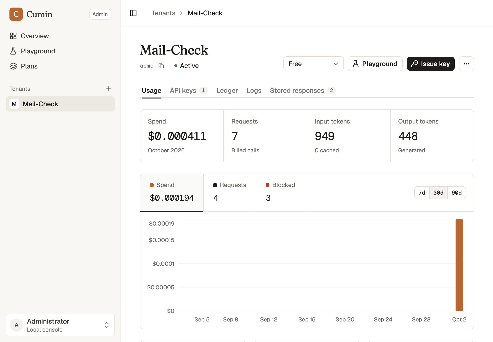

# Cumin

**Multi-tenant LLM API with Cost Attribution & Quotas**

One of the two project options for Group 14 in the ML System Design & LLMOps course (Scaler School of Technology).

## The problem

When one LLM API serves many teams or customers (tenants), every call costs money in tokens. Without per-tenant tracking there is no way to know who spent what, and without limits one heavy tenant can burn through the budget or crowd out everyone else.

## What this project is about

An LLM API built for multiple tenants that:

- Identifies which tenant each request belongs to and keeps their usage separate.
- Attributes cost to each tenant based on their actual usage (tokens consumed, per model).
- Enforces per-tenant quotas so usage stays within agreed limits.

## Admin console

The console at `/admin` covers tenants, plans, and usage. The overview shows this month's spend, requests, and tokens across every tenant, with a daily activity chart.



Each tenant page shows its plan, budget and rate-limit usage, cost per API key, the ledger, searchable request logs, and stored responses. The playground sends a real request through every gate on behalf of a tenant, and the Plans page creates and edits plans.



Build the console, then start the server. `CUMIN_PORT` sets the port (default `8000`).

```bash
cd web && npm install && npm run build && cd ..
uv run --env-file .env python main.py
```

## Baseline, before plan and budget checks

Measured on the unchecked path: `OpenAIInference.complete` has no auth, plan, or budget gate. Eight samples, one warmup discarded, model `gpt-4o-mini` (served as `gpt-4o-mini-2024-07-18`). Prompt: "In one sentence, explain what an API quota is." Each non-streaming call used 18 input tokens and 30–41 output tokens, with no cached input, at about `$0.000021`–`$0.000027`.

`complete` returns only after the full response, so that row is end-to-end latency. Time to first token is a streaming call with the same prompt, because `complete` does not stream.

| | Median | Mean | Min | Max |
|---|---:|---:|---:|---:|
| Full latency of `complete` | 1123 ms | 1147 ms | 840 ms | 1494 ms |
| Time to first token | 723 ms | 794 ms | 603 ms | 1495 ms |
| Streaming call, full response | 1065 ms | 1127 ms | 879 ms | 1808 ms |

Exact samples are in [benchmarks/unchecked_baseline.json](benchmarks/unchecked_baseline.json). Reproduce with:

```bash
uv run --env-file .env python scripts/benchmark_unchecked.py
```

## After auth, rate limit, and budget checks

Same prompt, model, and sample size. Latency is `RequestHandler.handle`: authenticate, rate-limit, bound the worst case, classify the prompt, reserve that worst case, call the model with the 512-token output cap, moderate the output, and settle. Time to first token runs those gates and then streams with the same cap, because `handle` does not stream. Each non-streaming call used 18 input tokens and 31–44 output tokens, at about `$0.000021`–`$0.000029`.

| | Median | Mean | Min | Max |
|---|---:|---:|---:|---:|
| Full latency of `handle` | 951 ms | 988 ms | 893 ms | 1348 ms |
| Time to first token | 648 ms | 655 ms | 585 ms | 759 ms |
| Streaming call, full response | 990 ms | 1014 ms | 883 ms | 1151 ms |

With eight samples, the two tables are within each other's run-to-run noise: the gates add no measurable latency next to the model call.

Exact samples are in [benchmarks/checked_baseline.json](benchmarks/checked_baseline.json). Reproduce with:

```bash
uv run --env-file .env python scripts/benchmark_checked.py
```

## Architecture and request flow

```text
Tenant client -> FastAPI POST /v1/summarize
  -> public-URL guard + page fetch + summary message construction
  -> RequestHandler: API-key authentication
  -> claim the tenant's idempotency key (replay, or 409 if held/reused)
  -> per-tenant rate limit -> worst-case bound (priced models only)
  -> input moderation -> BudgetGate: reserve the worst case in USD + tokens
  -> inference with the output cap -> output moderation
  -> settle billed usage/cost -> audit -> save result and drop the claim
  -> summary, model usage, cumulative spend and soft-budget warning

Admin console -> token-protected /v1/admin/* -> tenant/plan management
  -> ledger + tenant/key cost attribution + audit/search + usage chart
```

**Design choices and limits**

- API keys are hashed in SQLite; tenant IDs scope ledger, replay and audit.
  Cost arithmetic uses Decimal and model usage, including cached input.
- Reserve/settle keeps admission checks and concurrent holds inside SQLite
  transactions. Failures/rejected output release holds. See the hard-cap
  guarantee below.
- A shared SQLite Database uses `BEGIN IMMEDIATE` and a lock. It keeps the
  prototype easy to run and inspect, but serializes operations and is not a
  claim of distributed throughput or large-scale suitability.
- The default in-memory limiter is a rolling 60-second window local to one
  process. `REDIS_URL` selects the Redis fixed-minute limiter, which shares
  rate counters but has different window semantics and boundary bursts.
  Redis does not replace the SQLite quota ledger. Redis was not tested here.
- An idempotency key is claimed atomically before any model call, so a key
  is charged at most once, including across processes sharing the database.
  See the idempotency section below.
- Pattern moderation is deterministic but narrow. The production launcher
  uses OpenAI inference/moderation, and so do the evaluation and load
  benchmark. Public URL fetching happens before handler authentication and
  replay lookup; these measurements do not include fetching.
- The dashboard provides costs, usage and audit logs. Playground responses
  include latency; audit now persists handler-only latency; no tracing backend was
  added. See [pending decisions](docs/pending-decisions.md).

## Hard-cap guarantee

Every request is bounded before the model is called, and that bound is what
gets reserved:

- **Input:** at most the UTF-8 byte length of each message plus 4 tokens per
  message and 3 per request (`src/utils/tokens.py`). Byte-level BPE
  tokenizers, including gpt-4o-mini's, emit at least one byte per text token,
  so this is an upper bound. In the evaluation, OpenAI billed 18 tokens
  against a bound of 57.
- **Output:** capped at 512 tokens (`MAX_OUTPUT_TOKENS` in
  `src/services/request.py`), sent to OpenAI as `max_completion_tokens`.
- **Cost:** both bounds priced at the model's uncached input and output rates.
  Only models with a price in `src/utils/openai_cost.py` are accepted:
  `gpt-4o-mini` and `gpt-4o-mini-2024-07-18`, at $0.15 input, $0.075 cached
  input and $0.60 output per million tokens. Any other model is refused before
  any call with HTTP 400 and audited as `unsupported_model`.

`BudgetGate.reserve` holds the larger of the plan's per-request reserve (now a
minimum) and this worst case, atomically with every other open hold. If the
hold doesn't fit the remaining USD or token budget, the request is refused
with HTTP 402 before the model is called. After the call, `settle` records
the usage OpenAI billed, unchanged, and releases the unused part of the hold.
Since every admitted request fits its hold, spend and tokens stay within the
monthly caps.

**Overrun policy.** If a provider ever bills more than the hold (for example,
by ignoring the output cap), the full cost is still recorded; it is never
clipped or discarded. The ledger row gets `overrun = 1`, a warning is logged,
and the console's ledger shows the row as "Over hold". The tenant's later
requests are refused until spend is back under the cap, which in practice
means the next month.

The tradeoff is that holds are conservative. A 2,000-byte page holds about
2,000 input tokens even though it bills about 500, so tenants close to their
cap are refused somewhat earlier than strictly necessary.

## Idempotency

A request with an `Idempotency-Key` first claims that key for its tenant in a
single SQLite transaction (`IdempotencyStore.claim`). Only the request that
wins the claim goes on to call the model. The result is saved and the claim
dropped in one transaction. Other requests with the same key get one of
these answers:

| State of the key | Response |
|---|---|
| Result saved, same request | The saved result is replayed: no model call, no charge |
| Claimed by a request still running | 409 with `Retry-After: 2`; retry later to get the replay |
| Claimed more than 10 minutes ago and never completed | 409 "outcome unknown; use a new key", permanently |
| Used for a different request | 409 "used for a different request" |

Conflicts are audited as `idempotency_conflict`. A request is identified by
its URL and model on `/v1/summarize` and the playground, so a retry still
replays if the page has changed since.

**Failures.** If a request fails before it is charged (rate limit, budget,
moderation, provider error, rejected output), its claim is dropped and the
same key can be retried. If it fails after the charge (for example, the
result can't be saved), the claim stays, so the key can never trigger a second
model call. A claim left by a crashed process is never taken over: the process
may already have called OpenAI, and OpenAI's API has no idempotency key, so
taking it over could bill twice. Such a key answers "outcome unknown" from
then on, and the client must use a new key. That request's spend, if any, is
visible in the ledger.

Results saved before this change have no fingerprint and replay as before.

## Unit tests

`tests/` covers `BudgetGate` and the budget path through `RequestHandler`:
holds, worst-case bounds, exact cap boundaries, long input, maximum output,
several in-flight calls, overruns, unpriced models, release, settlement
errors, token caps, the soft warning, monthly reset, tenant separation,
concurrent reserves, the database-backed plan store, and billing around
moderation, provider errors and replays. `tests/test_idempotency.py` covers
key claims: a duplicate during inference, two handlers on separate
connections to one database file, release after failures before the charge,
a failed save after the charge, stale claims, key reuse, per-tenant scoping,
results saved before fingerprints existed, and the 409 mapping. They use a
local fake model, so they need no API key.

```bash
uv sync --frozen
uv run --frozen pytest
```

## Evaluation

Hand-written cases in [eval/cases.json](eval/cases.json), run on `gpt-4o-mini`
by [scripts/run_eval.py](scripts/run_eval.py) through `RequestHandler` with
OpenAI inference and moderation. Method and limits are in
[eval/README.md](eval/README.md); every summary and score from the recorded
run is in [eval/results.json](eval/results.json).

- **Summary quality:** ten pages, each with required facts, forbidden phrases
  and a word limit, run three times each. **26/30 trials** passed and
  **137/141 checks** passed. The model never followed the instruction planted
  in a page. Two misses were release-notes summaries over the 90-word limit
  (96 and 100 words) and two left out the council vote count.
- **Policy:** **21/21 invariants** passed. The budget cases confirm on OpenAI
  that the hold covers the bill, that the output cap is honoured, and that
  requests whose worst case can't fit are refused before the model. Two
  simultaneous requests with the same key made one model call and one
  charge: one completed and the other was refused as in progress.

The run made 49 model calls for $0.0026. The command exits 1 while any case
fails and writes all results first.

```bash
PYTHONDONTWRITEBYTECODE=1 uv run --frozen --env-file .env python scripts/run_eval.py
```

## Load benchmark

[scripts/benchmark_load.py](scripts/benchmark_load.py) sends the summary
prompt for the `release_notes` eval page to `gpt-4o-mini` through
`RequestHandler` with OpenAI moderation, using in-memory SQLite and the local
limiter. HTTP and URL fetching are excluded. Each scenario has 200 measured
requests after three discarded warmups, with two tenants alternating.
Percentiles are nearest-rank over successful requests. Requests go through
the current path, with the worst-case hold and the 512-token output cap. The
run was made on uncommitted changes on top of the `source_commit` recorded in
the JSON.

| Concurrency | Success | p50 | p95 | p99 | req/s | Cost/request |
|---:|---:|---:|---:|---:|---:|---:|
| 1 | 200/200 | 2536 ms | 3451 ms | 4004 ms | 0.37 | $0.000097 |
| 8 | 200/200 | 2545 ms | 3236 ms | 3468 ms | 3.02 | $0.000097 |

Requests averaged 183 input and about 116 output tokens; the longest summary
was 138 tokens, well under the cap. At concurrency 8, throughput rises about
8x while the median holds. Each tenant was billed for its own 100 requests in
each scenario (about $0.0097 each). The latency is mostly OpenAI: the model call plus two moderation
calls per request. Raw samples are in
[benchmarks/load_gpt-4o-mini.json](benchmarks/load_gpt-4o-mini.json) and
[benchmarks/load_gpt-4o-mini_samples.csv](benchmarks/load_gpt-4o-mini_samples.csv).

```bash
PYTHONDONTWRITEBYTECODE=1 uv run --frozen --env-file .env python scripts/benchmark_load.py --samples 200 --concurrency 1 8
```

## Submission caveats

Live deployment is optional and was not done. Runtime config wiring remains
open.
[Required decisions and unchanged-code evidence](docs/pending-decisions.md).

## Latency persistence (owner-approved issue 3)

Audit `latency_ms` is nullable and measures **handler-only time**: authentication,
replay lookup, limits, moderation, reservation, inference and settlement up to
recording the outcome. It excludes HTTP transport, URL fetching and the audit
insert itself. Response `handler_latency_ms` measures the same handler path
through return, including the final audit write, so it can be slightly larger.
This scope is consistent for completed, replayed, unauthenticated, rate-limited,
budget-blocked, input/output-rejected and provider-error outcomes already
recorded by the handler. A replay records its current lookup time, not the
original call's duration. Unexpected failures outside those existing audited
paths and URL-fetch errors are not newly traced by this change.

Public summary now includes per-call `cost_usd` and `handler_latency_ms`.
Usage events and admin log JSON/CSV expose nullable timing. Playground retains
its existing `latency_ms` (URL fetch + handler) alongside the explicitly named
handler metric. Historical audit rows migrate to NULL, never an invented zero.
No historical records are deleted. No dashboard UI rewrite was needed; timing
is available in the log API/export rather than a new chart.

```bash
PYTHONDONTWRITEBYTECODE=1 uv run --frozen python scripts/check_latency.py
```

The timing and migration checks pass.
